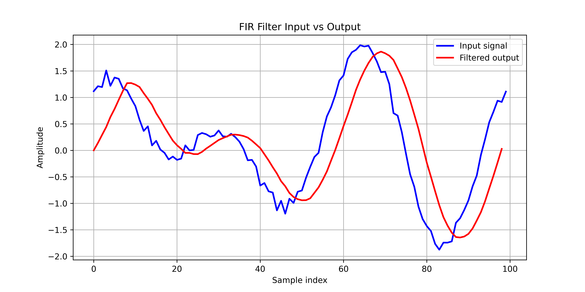

# FPGA Design Projects

This repository contains a collection of FPGA design projects implemented using **Verilog/SystemVerilog**.  
Projects are divided based on the tool used for synthesis:

---

## 🟢 Vivado Projects
- **fir_filter** (FIR filter implementation with testbench and simulation results)

## 🟠 Quartus Projects
- **adder** (basic 32-bit adder)
- **adder_block_ram** (adder with block RAM integration)
- **block_ram** (storing and retrieving data in block RAM)
- **button_control** (simple button-controlled logic)
- **led control** (basic LED control logic)
- **pipelined_adder** (32-bit pipelined adder)
- **state_machine** (FSM examples)
- **traffic_light_controller** (traffic light FSM)
- **uart** (UART TX/RX modules)
- **uart_adder** (adder controlled via UART interface)
- **uart_state_machine** (state machine integrated with UART)

---

## 📌 Project Descriptions

### 1. FIR Filter (Vivado)
The **FIR filter** is an 8-tap filter with coefficients quantized to 8 bits.  
It takes 16-bit signed input samples and produces a 32-bit signed output.  
The design demonstrates how FPGA resources can be used to implement DSP algorithms efficiently.  

The **testbench** reads input data from a file (`input.data`), processes it through the filter, and writes the output to another file (`save.data`). A Python script is then used to visualize both input and filtered signals.

**Simulation Output:**

---

### 2. UART RX/TX (Quartus)
The **UART project** implements both transmitter (TX) and receiver (RX) modules with standard **8N1 format** (8 data bits, no parity, 1 stop bit).  
- **TX**: Converts parallel data into serial form for transmission.  
- **RX**: Samples incoming serial data and reconstructs the parallel word.  

This project can be used to communicate between FPGA and PC (or another FPGA/MCU) over a standard UART link.  

---

### 3. 32-bit Adder (Quartus)
A simple **32-bit ripple-carry adder** that adds two 32-bit operands and produces a 32-bit sum with a carry-out.  
This module demonstrates the basics of combinational arithmetic circuits in Verilog.

---

### 4. Pipelined 32-bit Adder (Quartus)
The **pipelined adder** improves performance by splitting the 32-bit addition into smaller stages with registers between them.  
- Increases maximum operating frequency.  
- Demonstrates how pipelining can be used in arithmetic circuits to meet timing closure in high-speed designs.

---

### 5. Block RAM for Data Storage (Quartus)
The **block RAM projects** demonstrate how FPGA internal memory can be used to store intermediate results for further processing.  
- `block_ram`: Basic data storage and retrieval.  
- `adder_block_ram`: Stores operands in RAM, then retrieves them for addition.  
This technique is useful in DSP pipelines and applications where data buffering is required.

